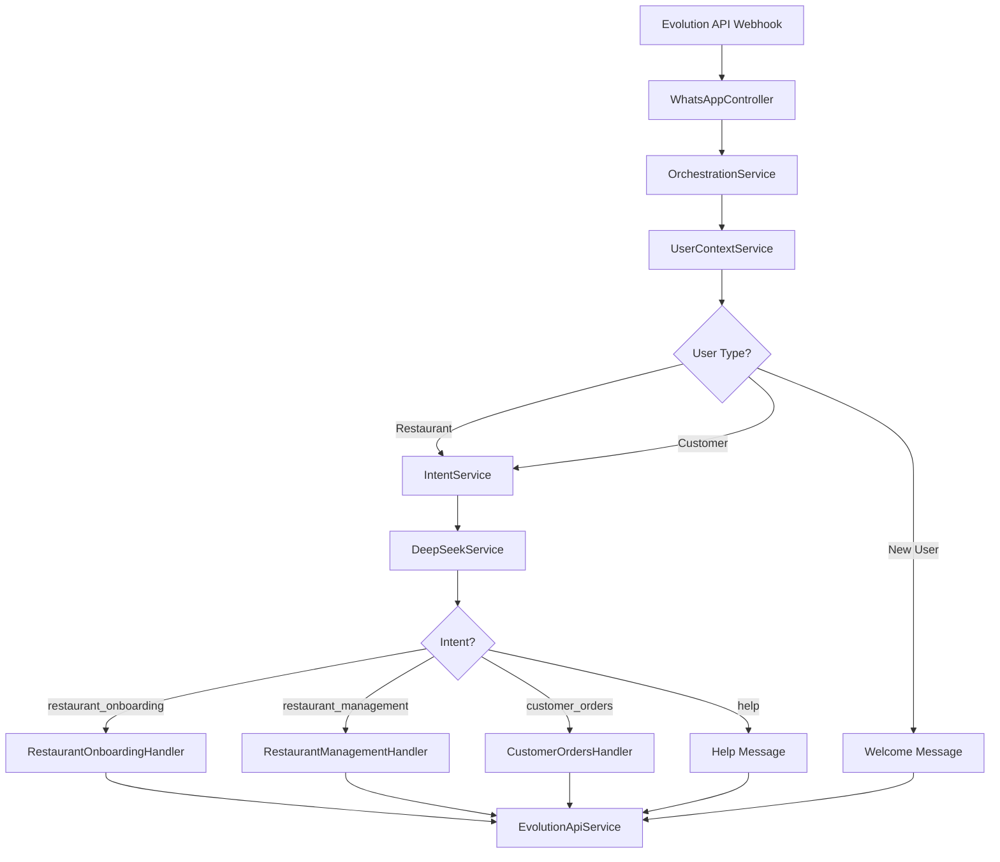
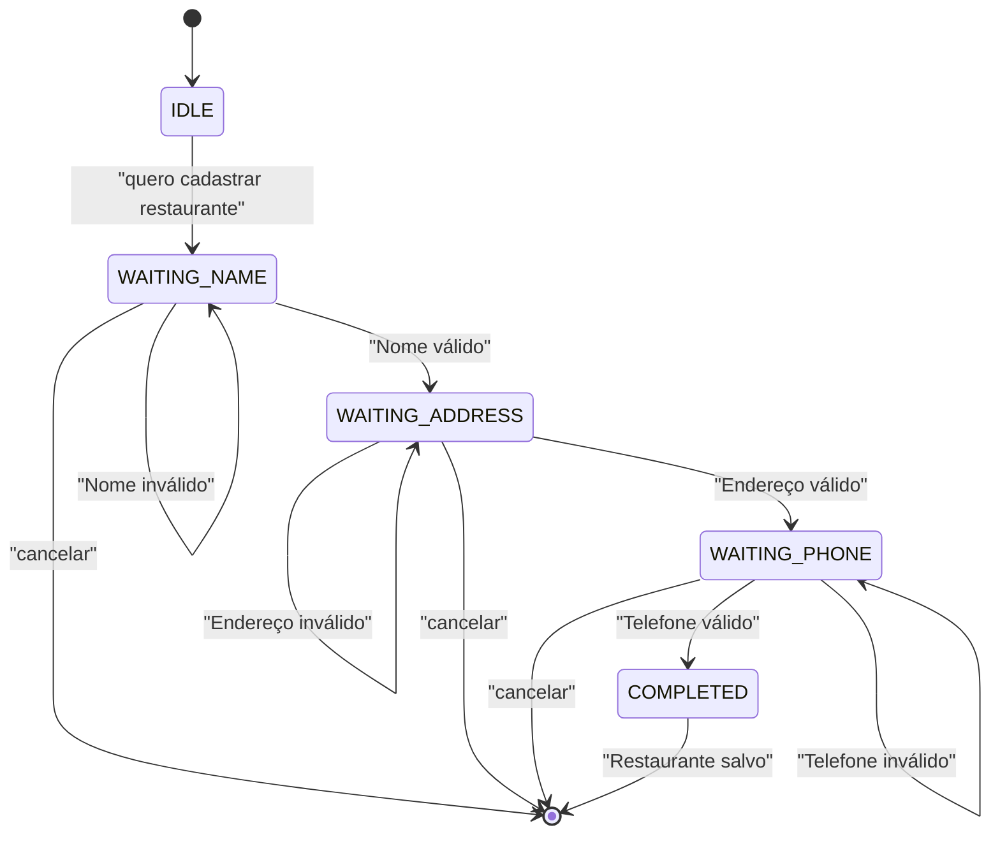
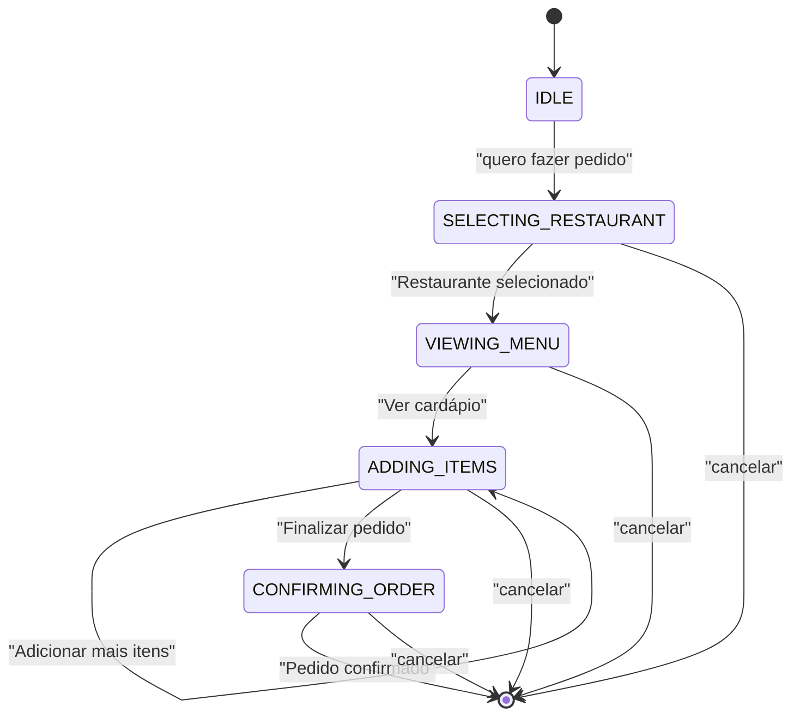
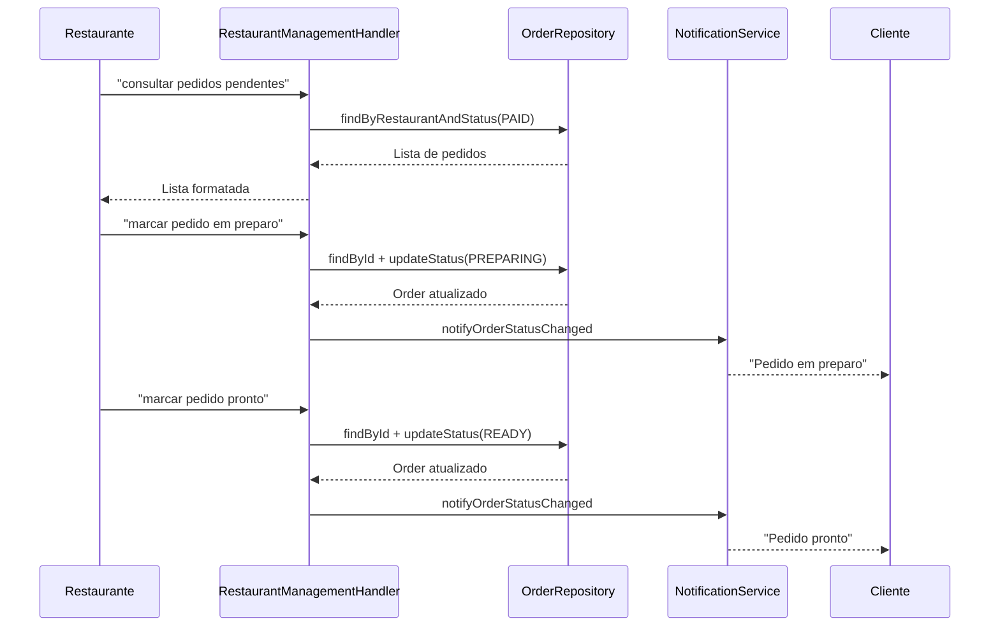
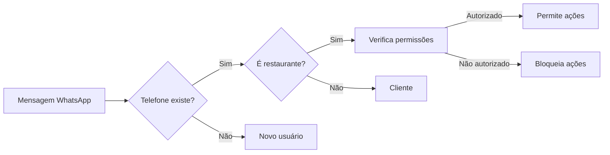
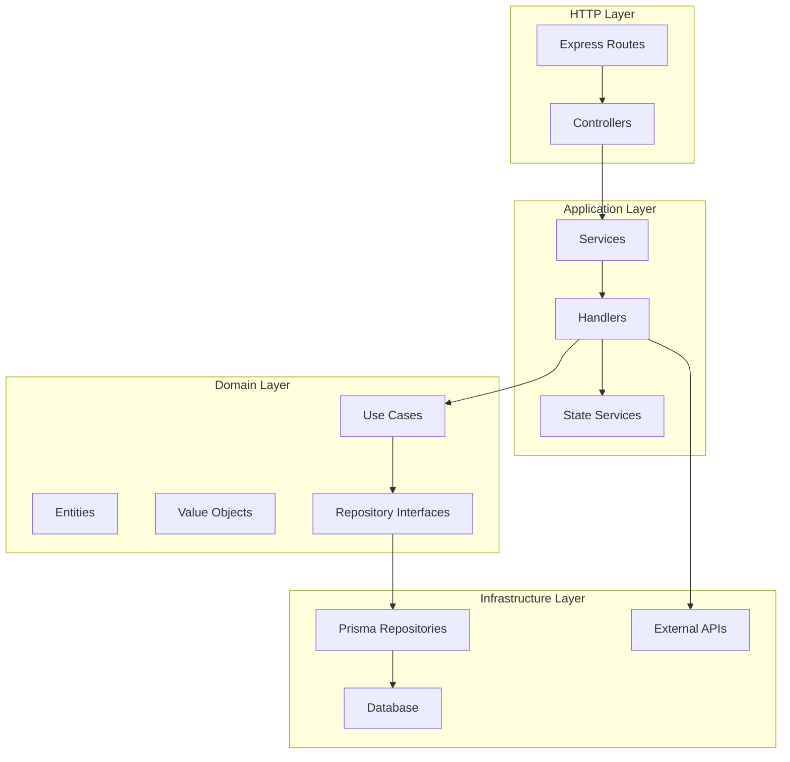
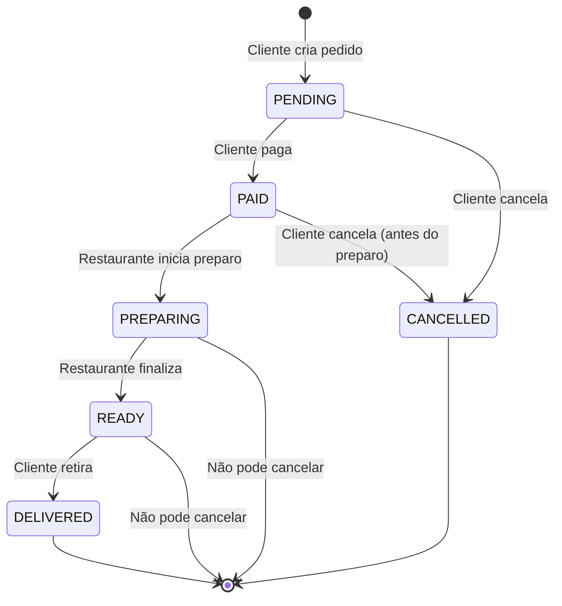

# 🏗️ Arquitetura e Fluxos - HeroCity

## 📊 Diagrama de Fluxo Principal



## 🔄 Fluxo de Onboarding de Restaurante



## 🛒 Fluxo de Criação de Pedido (Proposto)



## 🏪 Fluxo de Gestão de Pedidos (Restaurante)



## 📦 Estrutura de Dados

### Order Creation Flow

```typescript
// Estado inicial
{
  state: 'SELECTING_RESTAURANT',
  restaurantId: undefined,
  items: []
}

// Após selecionar restaurante
{
  state: 'VIEWING_MENU',
  restaurantId: 'rest-123',
  items: []
}

// Adicionando itens
{
  state: 'ADDING_ITEMS',
  restaurantId: 'rest-123',
  items: [
    { menuItemId: 'item-1', quantity: 2, price: 25.50 },
    { menuItemId: 'item-2', quantity: 1, price: 15.00 }
  ],
  total: 66.00
}

// Confirmando
{
  state: 'CONFIRMING_ORDER',
  restaurantId: 'rest-123',
  items: [...],
  total: 66.00
}
```

## 🔐 Fluxo de Autenticação (Futuro)



## 📊 Estrutura de Camadas



## 🎯 Padrões de Design Aplicados

### 1. State Machine Pattern
- `ConversationStateService` - Gerencia estados de conversação
- `OrderStateService` (futuro) - Gerencia criação de pedidos

### 2. Repository Pattern
- Interfaces no Domain Layer
- Implementações no Infrastructure Layer
- Facilita testes e troca de implementação

### 3. Strategy Pattern
- Handlers especializados por tipo de ação
- Fácil adicionar novos handlers

### 4. Dependency Injection
- Todas as dependências injetadas via construtor
- Facilita testes e manutenção

### 5. Service Layer Pattern
- Services orquestram lógica de negócio
- Handlers coordenam fluxos específicos

## 🔄 Ciclo de Vida de um Pedido



## 📱 Fluxo de Mensagens

### Exemplo: Novo Pedido

```
1. Cliente: "quero fazer um pedido"
   → Sistema: Lista restaurantes

2. Cliente: "1"
   → Sistema: Mostra cardápio

3. Cliente: "adicionar 2 hambúrgueres"
   → Sistema: "2x Hambúrguer adicionado. Total: R$ 50,00"

4. Cliente: "finalizar"
   → Sistema: "Pedido criado! Total: R$ 50,00"
   → Sistema (notifica restaurante): "Novo pedido #abc123"
```

## 🧪 Estrutura de Testes

```
tests/
├── unit/
│   ├── domain/
│   │   ├── entities/
│   │   ├── value-objects/
│   │   └── usecases/
│   └── application/
│       ├── services/
│       └── handlers/
├── integration/
│   ├── handlers/
│   ├── repositories/
│   └── services/
└── e2e/
    └── webhook-flow/
```

## 🔍 Pontos de Extensão

### 1. Adicionar Novo Handler
```typescript
// 1. Criar handler
class NewHandler {
  async handle(data: MessageData): Promise<void> {
    // Lógica
  }
}

// 2. Adicionar intent no enum
enum Intent {
  NEW_INTENT = 'new_intent'
}

// 3. Registrar no OrchestrationService
case Intent.NEW_INTENT:
  await this.newHandler.handle(data);
  break;
```

### 2. Adicionar Novo Use Case
```typescript
// 1. Criar use case
class NewUseCase {
  async execute(input: Input): Promise<Output> {
    // Lógica
  }
}

// 2. Injetar onde necessário
const newUseCase = new NewUseCase(repository);
```

### 3. Adicionar Nova Entidade
```typescript
// 1. Criar entity
class NewEntity {
  // ...
}

// 2. Criar repository interface
interface INewRepository {
  // ...
}

// 3. Implementar repository Prisma
class PrismaNewRepository implements INewRepository {
  // ...
}
```

